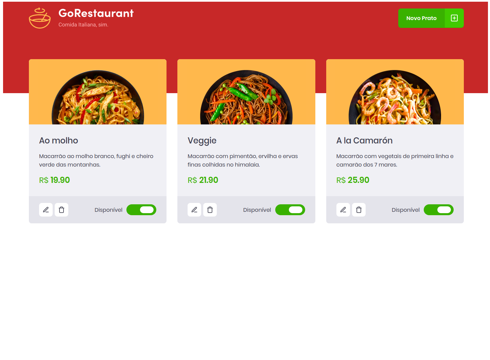

# GoRestaurant

## :rocket: Sobre

<p>O GoRestaurant é uma aplicação ficticia em <strong>React.js</strong> que se trata de um painel de adm para restaurantes
controlarem quais refeições estão disponíveis e quais estão indisponíveis.</p>

## Preview



## :books: Guia de instalação e execução

### Pré-requisitos

- [Git](https://git-scm.com/)
- [Node.js](https://nodejs.org/en/) v10.20 ou maior
- [Yarn](https://yarnpkg.com/)

### Como executar

- Clone este repositório
- Vá até o diretório
- Execute ```yarn``` para instalar as dependências
- Execute ```yarn server``` para rodar a API faker
- Execute em outro terminal ```yarn start``` para rodar a aplicação

Pronto! Você pode visualizar o GoRestaurant através do endereço http://localhost:3000

<br/>
<br/>

<a href="https://github.com/ThiagoFragata">
  
</a>

<br/>

Feito com 🧡+☕ por Thiago Henrique Fragata 👇🏻 Entre em contato!

<p align="center">
<a href="https://www.linkedin.com/in/thiago-henrique-fragata-2603b5207/" target="blank"></a>
<a href="https://www.facebook.com/tfragata" target="blank"></a>
<a href="https://www.instagram.com/_thiagofragata/" target="blank"></a>
</p>